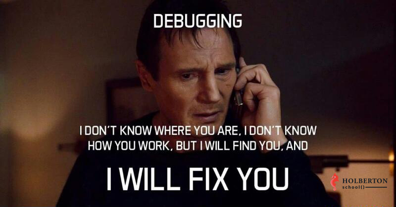

# 0x0E. Web stack debugging \#1

A lot of things can go wrong when setting up a web server.
It is important to know how to debug a web server in case of a failure.

This project is about debugging a Nginx web server.
