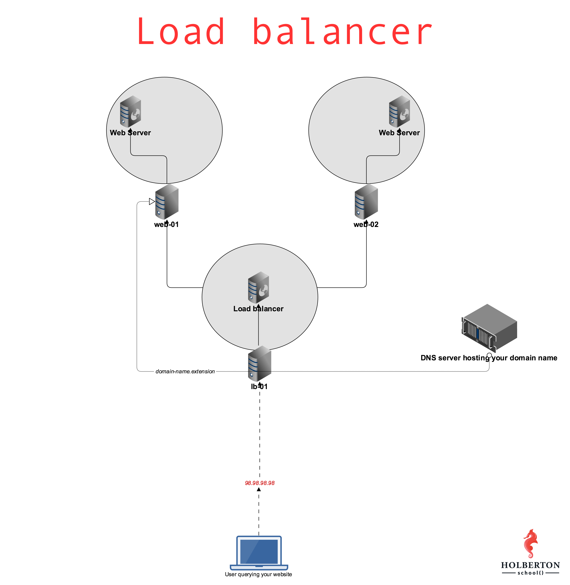

# 0x0F. Load balancer

A load balancer is a device that distributes network or application traffic across a number of servers.
Load balancers are used to increase capacity (concurrent users) and reliability of applications.
They do this by distributing traffic across multiple servers (also known as nodes).

A load balancer sits between clients and servers, receiving and then distributing traffic across the available servers.
Load balancers use a variety of methods (algorithms) to distribute traffic, including:
round-robin, least connections, IP hashing, and URL hashing.

This project is about setting up a load balancer for a high availability web server cluster.
